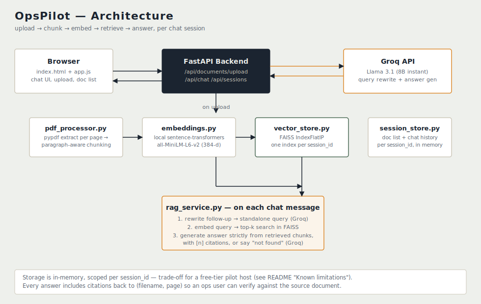

# OpsPilot

A document intelligence assistant for an ops team drowning in PDFs: rate cards, SOPs, vendor contracts, compliance circulars. Upload PDFs, ask questions, get answers grounded strictly in what was uploaded — with citations back to the source page.

Built for the VANCO AI internship assignment.

- **Live URL:** _add after deploying to Render_
- **Video walkthrough:** _add link_



## What it does

- Upload 2+ PDFs (rate cards, SOPs, contracts, circulars)
- Ask questions in chat; answers cite `[filename · page]` for every claim
- Follow-up questions resolve correctly ("what's the penalty clause?" → "and who does it apply to?")
- If the answer isn't in the documents, it says so instead of guessing
- Upload/loading/error states throughout — no silent failures

## Stack

| Layer | Choice | Why |
|---|---|---|
| Backend | FastAPI | Clean typed endpoints, async file handling, easy to test |
| Embeddings | `sentence-transformers/all-MiniLM-L6-v2`, local | Groq has no embeddings endpoint; a local CPU model avoids a second paid API and a second point of failure |
| Vector store | FAISS (`IndexFlatIP`), one index per session | Simple, fast, no external service to provision for a pilot |
| LLM | Groq (`llama-3.1-8b-instant`) | Free tier, fast inference, good enough quality for grounded Q&A |
| Frontend | Vanilla HTML/CSS/JS | No build step, deploys as static files served by FastAPI — one URL, one service |

## Chunking & retrieval — decisions and why

**Chunking:** page-first, then paragraph-aware, then hard character-window as a last resort.

1. Extract text **per page** (never merge across page boundaries) — every chunk stays traceable to a single, correct page number, which is what citations depend on.
2. Within a page, split on blank lines into paragraphs, then greedily pack paragraphs into ~1000-character windows so sentences aren't cut mid-thought where avoidable.
3. If a single paragraph is longer than the window (e.g. a dense contract clause), hard-split it with a 150-character overlap so a clause straddling a split point still appears intact in at least one chunk.

This is a hand-rolled splitter (no LangChain) — deliberately, so every line is something I can explain and change live in the walkthrough call, and so the repo doesn't read as a tutorial clone.

**Retrieval:** cosine similarity (normalized embeddings + `IndexFlatIP`) over the top 5 chunks for the current session only. No cross-session leakage — a session's FAISS index is created fresh per `session_id`.

**Conversational memory:** rather than just stuffing raw chat history into the retrieval query (which drifts fast), a follow-up message is first rewritten into a standalone query by the LLM using the last few turns of history, *then* embedded and searched. The rewritten query is also returned in the API response so it's visible/debuggable in the walkthrough.

**Grounding:** the answer-generation prompt instructs the model to answer only from the numbered context excerpts, cite `[n]` per claim, and explicitly say when something isn't in the documents — this is enforced by prompt instruction, not a separate verifier, which is a known limitation (see below).

## Project structure

```
opspilot/
├── backend/
│   ├── app/
│   │   ├── main.py            # FastAPI app & endpoints
│   │   ├── config.py          # env-driven settings
│   │   ├── schemas.py         # pydantic request/response models
│   │   ├── pdf_processor.py   # extraction + chunking
│   │   ├── embeddings.py      # local embedding model wrapper
│   │   ├── vector_store.py    # per-session FAISS index
│   │   ├── llm_service.py     # Groq: query rewrite + answer generation
│   │   ├── rag_service.py     # orchestrates retrieval + generation
│   │   └── session_store.py   # per-session doc list + chat history
│   └── requirements.txt
├── frontend/
│   ├── index.html
│   ├── style.css
│   └── app.js
├── Dockerfile
├── render.yaml
└── .env.example
```

Retrieval/LLM logic lives entirely in the `app/` service layer — `main.py` only wires HTTP requests to those services, so it's testable without a server running (see `backend/app` — every module was smoke-tested independently during development).

## Running locally

```bash
cd backend
python -m venv venv && source venv/bin/activate
pip install -r requirements.txt
cp ../.env.example .env      # then fill in GROQ_API_KEY
uvicorn app.main:app --reload --port 8000
```

Open `http://localhost:8000` — the backend serves the frontend directly, so there's only one URL.

**Get a free Groq API key:** https://console.groq.com/keys

## Running with Docker

```bash
docker build -t opspilot .
docker run -p 8000:8000 -e GROQ_API_KEY=your_key_here opspilot
```

## Deploying to Render

1. Push this repo to GitHub.
2. New → Web Service → connect the repo → Render detects `render.yaml`, or set it up manually as a **Docker** environment.
3. Add the `GROQ_API_KEY` environment variable in the Render dashboard (never commit it).
4. Deploy. Free tier spins down on idle — the first request after a while will be slow (cold start), which is normal.

## Known limitations

- **In-memory storage.** Both the FAISS index and chat history live in process memory, keyed by `session_id` (stored in the browser's `localStorage`). This means: (a) documents and history are lost if the Render free-tier instance spins down from idle, and (b) it won't scale past a single process/worker. This was a deliberate scope trade-off for a pilot rather than adding a paid Postgres/pgvector instance or Redis the client hasn't asked for yet.
- **Scanned/image PDFs aren't handled.** `pypdf` extracts embedded text only — a scanned contract with no OCR text layer will be rejected with a clear error, not silently produce empty answers.
- **No hybrid retrieval or reranking yet** (see stretch goals below) — dense retrieval alone can miss exact-keyword matches like clause numbers or vendor names that don't paraphrase well.
- **Groundedness is prompt-enforced, not verified.** There's no separate step that checks the final answer's citations actually support each claim; it relies on instruction-following.
- **Single free-tier LLM call per retrieval step**, so a heavily loaded free Groq account could rate-limit under concurrent users — there's no request queueing yet.

## What I'd build next with one more week

1. **Hybrid retrieval** — add BM25 alongside dense retrieval (logistics documents are full of exact clause numbers, vendor names, SKUs that embeddings can miss) and measure whether it actually changes answer quality on a small eval set, not just assume it helps.
2. **Persistent storage** — move the vector index to pgvector or Qdrant's free tier and chat history to a small Postgres table, so a session survives a Render cold start/restart.
3. **Streaming responses** — token-by-token via Server-Sent Events, so answers feel responsive instead of appearing all at once after a multi-second wait.
4. **A citation-verification pass** — a cheap second LLM call (or a simple overlap heuristic) that flags when a citation doesn't actually support the sentence it's attached to, before returning the answer.
5. **Multi-file drag reorder / delete individual documents** from a session without clearing the whole thing.
6. **Basic eval harness** — a small set of question/expected-answer pairs per sample document to catch retrieval regressions when chunking parameters change, instead of eyeballing it.

## AI assistance disclosure

Built with Claude's help for scaffolding and iteration speed, per the assignment's rules — every module was run and tested locally (not just generated) before being included, and I can walk through and modify any part of it live.
